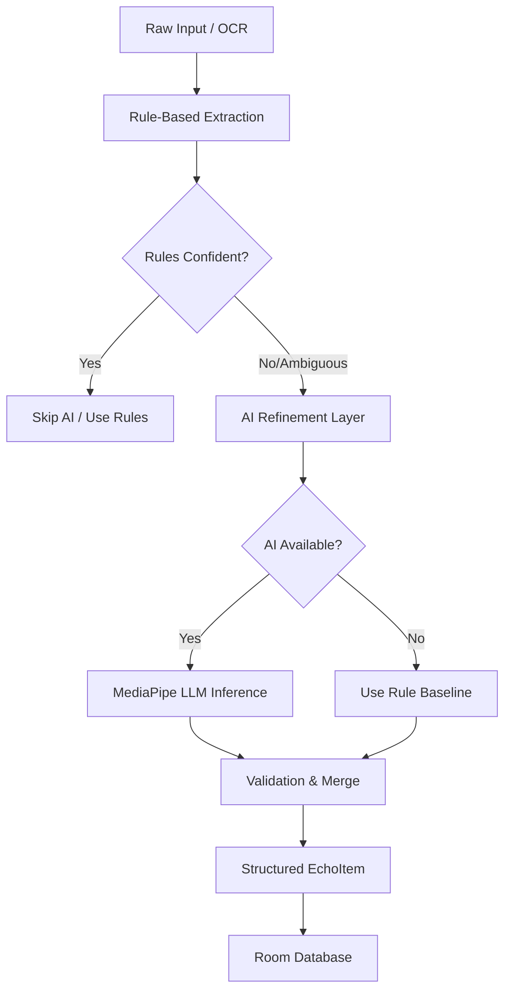

# Implementation Plan - On-Device Hybrid AI Intelligence Layer

This plan adds a **fully on-device** AI refinement layer to the Echo capture pipeline. It prioritizes data privacy and offline functionality by using **MediaPipe LLM Inference** (Gemma 2B) on-device, ensuring compatibility with high-end devices like your iQOO test device, while maintaining the rule-based system as the authoritative baseline.

## Device & Compatibility Report

| Feature | Support Status | Note |
| :--- | :--- | :--- |
| **Project Setup** | ✅ Ready | `compileSdk 35` and `minSdk 26` are fully compatible with modern AI SDKs. |
| **Gemini Nano (AICore)** | ❌ Unsupported | Currently restricted to Google Pixel 8+ and Samsung S24+ series. iQOO/Vivo devices do not have AICore support yet. |
| **ML Kit GenAI** | ❌ Unsupported | Also relies on Gemini Nano/AICore. |
| **MediaPipe LLM Inference** | ✅ **Recommended** | Cross-device support for modern Android GPUs. Can run Gemma 2B or Phi-2 on your iQOO device. |
| **Model Requirements** | ⚠️ High | Requires downloading/bundling a ~1.3GB model (e.g., `gemma-2b-it-gpu-int4`). |

## Proposed Architecture

## User Review Required

> [!IMPORTANT]
> **Model Download**: Since Gemini Nano isn't available on iQOO, we must use MediaPipe with an on-device model like Gemma 2B. This model is ~1.3GB. In a production app, this would be a "Feature Download", but for the hackathon, we will implement the logic to load it from a specific path.

> [!WARNING]
> **Rule Authority**: As requested, AI will **only** refine descriptive fields (Title, Intent, Category). **Date validation and Notification scheduling** will strictly remain under the control of the local `EntityExtractor` to prevent hallucinated reminders.

## Proposed Changes

### 1. Build Configuration
Add the MediaPipe GenAI dependency.

#### [MODIFY] [build.gradle](file:///C:/Users/shiva/StudioProjects/Echo-/app/build.gradle)
- Add `com.google.mediapipe:tasks-genai:0.10.14`.
- *Note: No Cloud AI SDKs or API keys will be added.*

### 2. The Intelligence Layer
Create the orchestrator that manages the hybrid logic.

#### [NEW] [EchoIntelligenceProcessor.kt](file:///C:/Users/shiva/StudioProjects/Echo-/app/src/main/kotlin/com/hackathon/echo/ocr/EchoIntelligenceProcessor.kt)
- **Baseline**: Runs `Categorizer` and `EntityExtractor` first.
- **Complexity Check**: If the text is very short or rules are 100% certain, it returns early.
- **AI Refinement**: Initializes `LlmInference` using a local model path.
- **Prompt**: *"Analyze this text and improve the Title, Category, and Intent. Input: {json}. Output only JSON."*
- **Merge Logic**:
    - AI provides: `title`, `category`, `intent`, `location`.
    - Rules provide: `date`, `reminderAt` (Authoritative).

### 3. Capture Pipeline Refactor
Integrate the processor into `CaptureActivity`.

#### [MODIFY] [CaptureActivity.kt](file:///C:/Users/shiva/StudioProjects/Echo-/app/src/main/kotlin/com/hackathon/echo/capture/CaptureActivity.kt)
- Update `saveToDatabase` to use `EchoIntelligenceProcessor.process()`.
- Ensure `isAiRefined` flag is set when the AI layer successfully returns a result.

### 4. UI Polish
Indicate the on-device AI enhancement.

#### [MODIFY] [MainActivity.kt](file:///C:/Users/shiva/StudioProjects/Echo-/app/src/main/kotlin/com/hackathon/echo/MainActivity.kt)
- Add a "✨ LOCAL AI" badge to `EchoCard`.

---

## Verification Plan

### Automated Tests
- Build verification via `./gradlew assembleDebug`.
- Logcat monitoring for `INTELLIGENCE: AI refinement successful` vs `INTELLIGENCE: Model not found, using rules`.

### Manual Verification
1. **Rule Test**: Share a simple "Buy milk tomorrow" text. Verify it uses the rule engine and schedules a 9 AM reminder.
2. **AI Test**: Share a complex article snippet. Verify the title becomes a concise summary instead of just the first line.
3. **Safety Test**: Verify that AI NEVER changes the `reminderAt` time once calculated by the rule engine.
